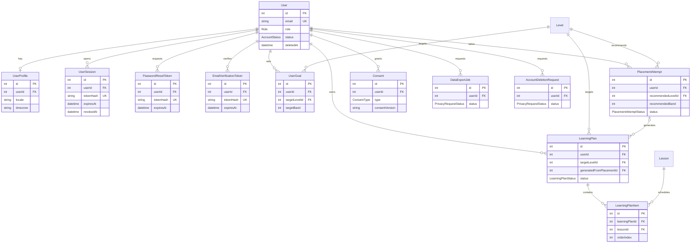
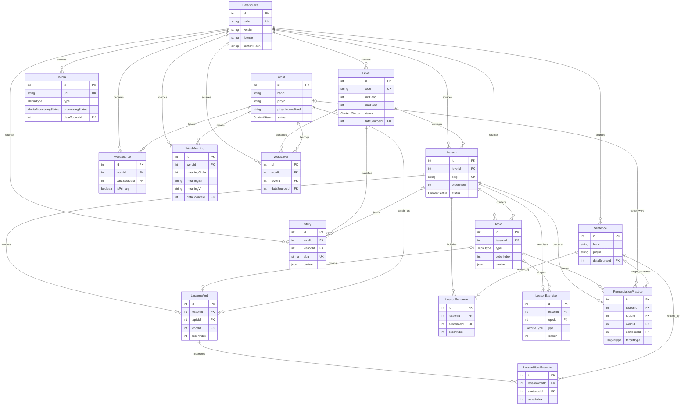
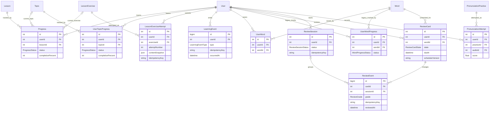
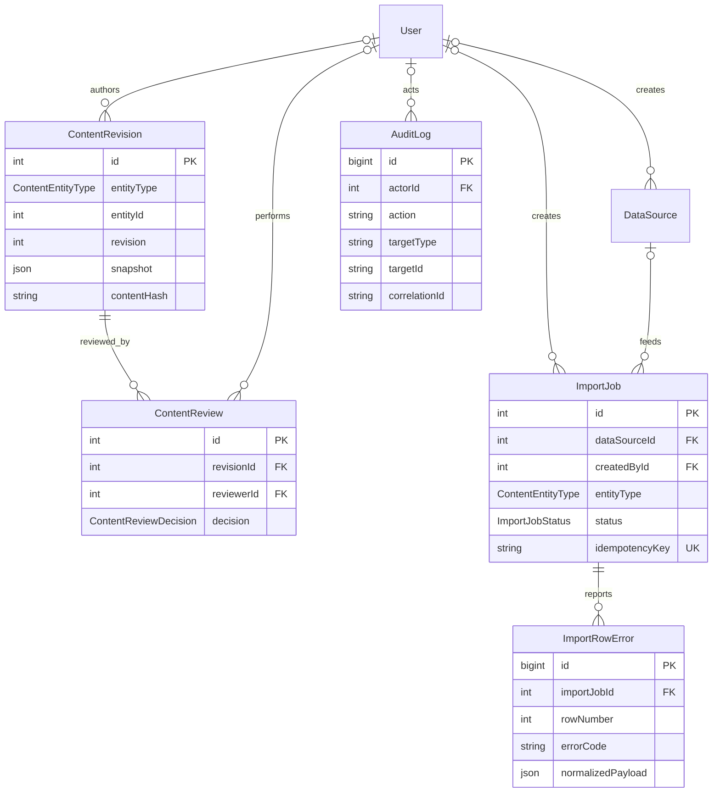
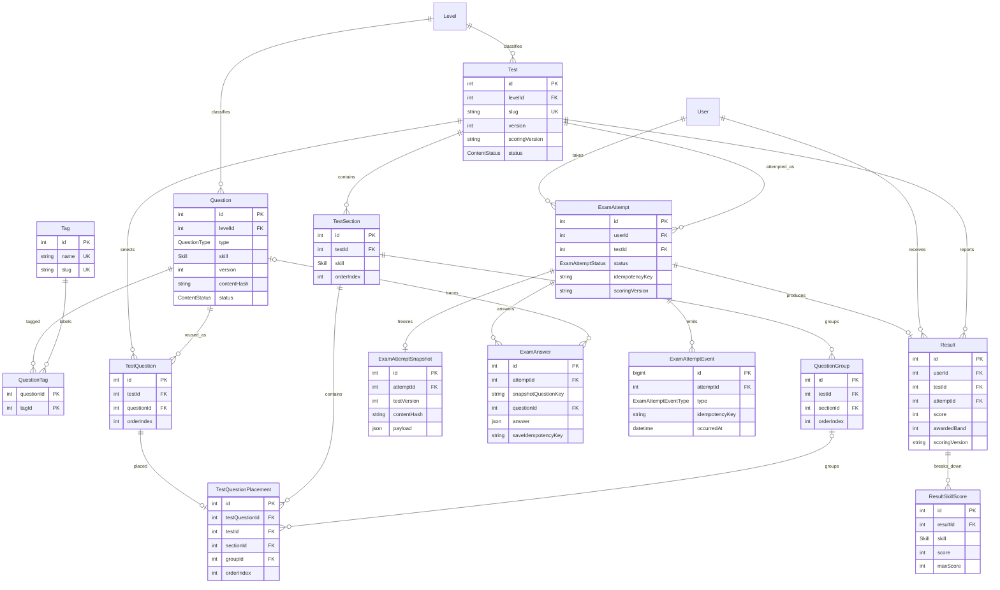
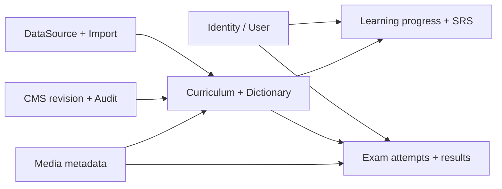

# P0 ERD — HSK 3.0 APP

> ERD logic phiên bản `2.1.0-p0-hardening`, chốt ngày `2026-08-10`.
> File `docs/erd.png` là sơ đồ legacy và đã bị tài liệu này thay thế. Prisma schema/migration vẫn là nguồn kỹ thuật chuẩn khi có khác biệt.

ERD được tách theo bounded context để review được. Các cột dưới đây chỉ hiển thị PK/FK và trường nhận diện chính; data dictionary chứa đầy đủ semantics và invariant.

## 1. Identity, onboarding và privacy



## 2. Curriculum, dictionary, provenance và media



## 3. Learning progress, SRS và pronunciation attempt



## 4. CMS workflow, import và audit



`ContentRevision.entityId` và `AuditLog.targetId` là polymorphic reference có chủ đích; service phải kiểm tra entity tồn tại và ghi `entityType/targetType` đúng allow-list. Không tạo FK polymorphic giả trong database.

## 5. Exam engine và result



Điểm then chốt của mô hình placement là chuỗi composite FK:

```text
TestQuestionPlacement(testQuestionId, testId)
  -> TestQuestion(id, testId)

TestQuestionPlacement(sectionId, testId)
  -> TestSection(id, testId)

TestQuestionPlacement(groupId, sectionId, testId)
  -> QuestionGroup(id, sectionId, testId)
```

Nhờ đó question bank vẫn tái sử dụng được, nhưng một placement không thể vô tình trỏ sang section/group của đề khác.

## 6. Quan hệ cross-context quan trọng



- Identity cung cấp actor/owner, nhưng content và lịch sử thi không được phụ thuộc vào raw PII.
- Curriculum publish tạo input cho Learning/Exam; attempt luôn snapshot trước khi learner tương tác.
- Import chỉ tạo/đổi content qua provenance và audit; không ghi đè lịch sử attempt.
- Trigger SQL bổ sung các invariant mà Prisma không biểu đạt được: append-only, child cùng lesson, result cùng attempt và placement cùng test.
- Hardening trigger còn đối chiếu band theo Level và ReviewEvent card/session cùng user; FK `RESTRICT` giữ parent của immutable fact để deletion workflow dùng anonymization thay vì hard-delete.
