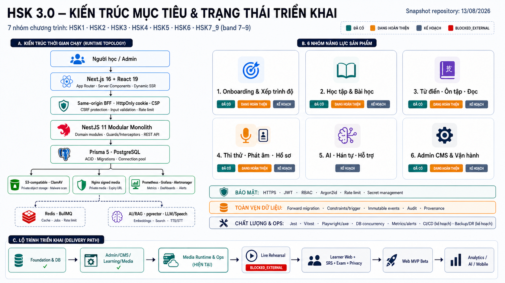

# Product Roadmap — HSK 3.0

> Cập nhật: 13/08/2026
>
> Baseline kiểm tra: branch macdev, commit a86b6224b53b840373d697f9f45509cf47e7eb6f
>
> Trạng thái tổng thể: PRE-BETA — backend và admin foundation đã hình thành; Media đang production-hardening; Web MVP cho người học và production readiness toàn hệ thống chưa hoàn tất.

## 1. Cách đọc tài liệu

Roadmap này phân biệt bốn loại bằng chứng:

| Trạng thái  | Ý nghĩa                                                                                                                |
| ----------- | ---------------------------------------------------------------------------------------------------------------------- |
| DONE V1     | Có runtime trong repository, contract chính và test phù hợp phạm vi V1. Không mặc nhiên có nghĩa đã chạy production.   |
| IN PROGRESS | Đã có một phần runtime/schema/UI nhưng còn gap chức năng, reliability hoặc release gate.                               |
| PLANNED     | Mục tiêu đã được xác định nhưng chưa có runtime end-to-end. Schema hoặc mockup riêng lẻ không được tính là hoàn thành. |
| BLOCKED     | Không được đưa vào release candidate cho tới khi dependency, dữ liệu, pháp lý hoặc hạ tầng được giải quyết.            |

Nguồn sự thật theo thứ tự:

1. Code runtime, schema/migration và test trên HEAD hiện tại.
2. ADR, runbook và evidence được tạo từ chính HEAD đó.
3. Roadmap này cho thứ tự delivery.
4. docs/ui_image cho thiết kế UI theo từng module/page khi triển khai UI.

Ảnh assets/roadmap_prod.jpg là concept kiến trúc ban đầu, không phải bằng chứng completion. Bản cập nhật có phân lớp trạng thái nằm tại:

## 2. Tầm nhìn và phạm vi sản phẩm

HSK 3.0 là nền tảng web học, ôn và thi HSK theo bảy nhóm chương trình:

- HSK1, HSK2, HSK3, HSK4, HSK5, HSK6.
- HSK7_9 là một nhóm curriculum; kết quả có thể dùng band 7–9.

Hai nhóm người dùng chính:

- Người học: onboarding, lộ trình, bài học, luyện tập, từ điển, SRS, thi thử, kết quả và quyền riêng tư.
- Admin/content/operations: quản lý nội dung, review/publish/import, media, người dùng, chất lượng dữ liệu, audit, báo cáo và vận hành.

Lời hứa của Web MVP:

1. Người học tạo tài khoản, chọn mục tiêu và nhận lộ trình phù hợp.
2. Người học có thể học một bài, làm activity, nhận kết quả và lưu tiến độ.
3. Người học tra từ, lưu từ và ôn đúng hạn.
4. Người học hoàn thành một bài thi end-to-end, xem kết quả và lịch sử bất biến.
5. Admin có thể chuẩn bị, review, publish và vận hành nội dung an toàn.
6. Hệ thống có thể phát hành, quan sát, rollback/roll-forward và phục hồi dữ liệu theo mục tiêu được phê duyệt.

## 3. Kiến trúc: hiện tại và mục tiêu

### 3.1 Hiện tại đã nối runtime

- Frontend: Next.js 16.3, React 19, TypeScript strict; same-origin BFF, cookie HttpOnly/SameSite, CSP; hiện chủ yếu là login và Admin Exercise/Media read console.
- Backend: NestJS 11 modular monolith với Auth, User, Onboarding, Learning, Dictionary, CMS, Media và Health.
- Database: PostgreSQL + Prisma 5; 59 model, 27 enum và 19 forward migration (migration 19 `media_cleanup_audit_integrity` thêm ngày 22/08/2026 sau baseline).
- Media: S3-compatible private adapter, ClamAV, Sharp/music metadata, signed delivery, Nginx edge và observability chuyên biệt cho Media ở mức code.
- Quality: Jest, Vitest, Playwright/axe, database integration và concurrency harness cho các slice đã triển khai.

### 3.2 Mục tiêu chưa được hiểu là đã hoàn thành

- Public learner frontend cho onboarding, learning, dictionary, SRS, exam và privacy.
- Exam engine, review scheduler, pronunciation, reader, materials, analytics và support runtime.
- Redis/BullMQ chỉ thêm khi workload, retry, ordering và shared-state boundary chứng minh nhu cầu.
- AI/RAG giữ service và database boundary riêng; chỉ triển khai sau provenance, evaluation, citation, privacy và safety gate.
- Mobile/offline là P2; chưa chốt Flutter. React Native/Expo hoặc lựa chọn khác cần ADR và product evidence.
- CI/CD, container/IaC, staging, immutable artifact promotion, project-wide observability, backup/restore và DR.

### 3.3 Những điểm đã sửa so với concept ban đầu

- Dùng Next.js/React cho web, không tuyên bố Flutter/Android đã có.
- Password hashing hiện dùng Argon2id, không phải Bcrypt.
- Storage production hướng tới S3-compatible private object storage; không tuyên bố Cloudinary integration.
- Browser đi qua same-origin BFF, không cầm bearer token.
- Bảy nhóm curriculum, không phải chín Level độc lập.
- Phân biệt Media observability hiện có với observability toàn hệ thống.
- Phân biệt UI mockup tại docs/ui_image với route đã chạy.

## 4. Snapshot repository hiện tại

| Khu vực              | Evidence hiện tại                                                                       | Diễn giải                                                                                             |
| -------------------- | --------------------------------------------------------------------------------------- | ----------------------------------------------------------------------------------------------------- |
| CodeGraph            | 316 files, 3.480 nodes, 7.132 edges, 8,32 MB; index up to date                          | Dùng để khảo sát dependency, không thay compiler/test/runtime evidence.                               |
| Database             | 59 Prisma model, 27 enum, 18 forward migration                                          | Schema rộng hơn runtime; nhiều domain mới chỉ schema-ready.                                           |
| Backend runtime      | Auth, CMS, User, Dictionary, Health, Learning, Media, Onboarding                        | Chưa có Exam, SRS scheduler, Analytics hoặc AI runtime module.                                        |
| Frontend runtime     | Login, forbidden, Admin Exercise list/detail, Admin Media list/detail                   | Root vẫn redirect tới Admin Exercise; chưa có learner app.                                            |
| AI                   | Scaffold tối thiểu                                                                      | Chưa có ingest, retrieval, chat, evaluation hoặc provider runtime.                                    |
| Dictionary artifacts | 121.856 word, 200.156 English meaning, 11.086 word-level mapping trong parsed artifacts | Không phải live DB count của lần review; nghĩa Việt và license một số HSK list chưa production-ready. |
| Operations           | Media-specific runbook/dashboard/alerts/topology/evidence harness                       | Chưa có project-wide CI/CD, backup/restore, support hoặc DR.                                          |

## 5. Ma trận năng lực sản phẩm

### 5.1 Onboarding và identity

| Capability             | Trạng thái      | Đã có                                            | Còn thiếu để hoàn thành                                                         |
| ---------------------- | --------------- | ------------------------------------------------ | ------------------------------------------------------------------------------- |
| Auth register/login/me | DONE V1         | Argon2id, active-account JWT, RBAC và rate limit | Email verification, reset password, refresh/revoke/session lifecycle hoàn chỉnh |
| Goal + Learning Plan   | DONE V1 backend | Goal, target level/band và learning plan         | Learner UI và product analytics                                                 |
| Placement              | IN PROGRESS     | Schema PlacementAttempt                          | Question selection, scoring, result contract và UI                              |
| Profile/privacy        | IN PROGRESS     | Schema profile, consent, export, deletion        | API/worker anonymization, export, consent UX và operational verification        |

### 5.2 Learning và lesson

| Capability          | Trạng thái       | Đã có                                                         | Còn thiếu để hoàn thành                                                      |
| ------------------- | ---------------- | ------------------------------------------------------------- | ---------------------------------------------------------------------------- |
| Public content read | DONE V1 backend  | Level/Lesson/Topic/Story visibility và readiness              | Learner navigation/UI                                                        |
| Lesson Activity     | DONE V1 backend  | Start/complete, scoring, immutable attempt/event, idempotency | Speaking scoring và learner player                                           |
| Progress/resume     | DONE V1 backend  | Lesson/topic progress và resume                               | Dashboard người học và analytics                                             |
| Curriculum content  | BLOCKED một phần | Seed/pipeline và content model                                | Loại nội dung Temporary dùng test; content QA, reviewer và production corpus |

### 5.3 Dictionary, review và reader

| Capability                   | Trạng thái      | Đã có                                        | Còn thiếu để hoàn thành                                           |
| ---------------------------- | --------------- | -------------------------------------------- | ----------------------------------------------------------------- |
| Dictionary search            | DONE V1 backend | Hanzi/Pinyin prefix lookup và visibility     | Detail API/UX, example/audio và performance SLO production        |
| Save word                    | IN PROGRESS     | UserWord/UserWordProgress schema             | Owner API, UI và lifecycle                                        |
| SRS                          | PLANNED         | ReviewCard/Session/Event schema và integrity | Scheduler, due queue, session API, scoring policy và flashcard UI |
| Interactive reader/materials | PLANNED         | Story/Sentence/Media schema một phần         | Reader progress, annotation, access policy và learner UI          |
| Vietnamese content           | BLOCKED         | English meaning artifact đã có               | Nguồn, license, translation/review workflow và quality evidence   |

### 5.4 Exam, pronunciation và account

| Capability          | Trạng thái  | Đã có                                                    | Còn thiếu để hoàn thành                                              |
| ------------------- | ----------- | -------------------------------------------------------- | -------------------------------------------------------------------- |
| Exam data integrity | IN PROGRESS | Test/section/group/attempt/snapshot/answer/result schema | Runtime module và release evidence                                   |
| Exam delivery       | PLANNED     | —                                                        | Start, autosave, resume, timer, review, submit, scoring và result UI |
| Pronunciation       | PLANNED     | Pronunciation schema                                     | Consent/retention, recording pipeline, provider, rubric và feedback  |
| Account dashboard   | PLANNED     | Một phần profile/progress schema                         | Learner UI, history, privacy controls                                |

### 5.5 Admin CMS và Media

| Capability                | Trạng thái              | Đã có                                                        | Còn thiếu để hoàn thành                                                     |
| ------------------------- | ----------------------- | ------------------------------------------------------------ | --------------------------------------------------------------------------- |
| CMS Lesson/Topic          | DONE V1 backend         | Revision, review, publish, archive, audit                    | Mutation UI, scheduling và expanded entity coverage                         |
| Exercise authoring/import | DONE V1 backend         | Authoring, review/publish/archive, preview + atomic import   | Full admin mutation UI và speaking support                                  |
| Admin Exercise console    | IN PROGRESS             | Secure read list/detail                                      | Create/edit/review/publish/import UI                                        |
| Media Admin Library       | DONE V1 read/operations | List/detail, quarantine/archive UI                           | Upload UI, processing status UX và operator reconciliation UI               |
| Secure Media ingestion    | IN PROGRESS             | Private storage, scan, processing, signed content và metrics | Runtime deadline/recovery/SLO hardening, Linux AMD64 gate và live rehearsal |
| Admin users/reports       | PLANNED                 | Admin user read API tối thiểu                                | Role/lifecycle operations, audit UX, analytics và reports                   |

### 5.6 Analytics, AI và growth

| Capability               | Trạng thái    | Điều kiện bắt đầu                                                                          |
| ------------------------ | ------------- | ------------------------------------------------------------------------------------------ |
| Product analytics        | PLANNED P0/P1 | Event taxonomy, privacy basis, reconciliation và metric owner                              |
| Notifications/support    | PLANNED P1    | Consent, preference, delivery provider, SLA/escalation và feedback loop                    |
| AI/RAG                   | PLANNED P2    | Licensed corpus, ACL, citations, golden eval, provider DPA/retention, safety và cost guard |
| Hanzi/OCR                | PLANNED P2    | Product validation, licensed data/model, privacy và evaluation                             |
| Subscription/payment     | DEFERRED P2   | Business model, legal/tax/refund/reconciliation và entitlement design                      |
| Mobile/offline/community | DEFERRED P2   | Web MVP outcome, device need, sync/conflict model, moderation và store strategy            |

## 6. Lộ trình delivery theo dependency

Roadmap không cam kết ngày khi chưa có capacity, owner và dependency evidence. Các workstream có thể chạy song song, nhưng không được bỏ qua gate.

### NOW — M0: Media internal closeout và control plane

Outcome: Media không còn P0/P1 nội bộ và có bằng chứng tái lập trên nền tảng production.

- Đóng absolute deadline/cancellation cho ClamAV và S3 body stream.
- Đóng cleanup recovery, secret scanner false-negative và truthful availability SLI.
- Hardening forward-only migration/preflight và bounded lock deployment.
- Validate exact rendered Kubernetes artifact, OCI identity và Linux AMD64.
- Cập nhật roadmap, owner, risk/decision register và release evidence contract.

Exit:

- Không còn P0/P1 trong scope Media.
- Full internal gate GREEN trên Linux AMD64.
- Không trộn local evidence với immutable CI attestation.
- Chỉ sau đó mới chạy Live Media Infrastructure Rehearsal.

### NEXT — M1: Content/legal + Identity/Privacy foundation

Outcome: dữ liệu và tài khoản đủ an toàn để mở learner beta.

- Xác minh license/provenance của bảy HSK word list.
- Xây Vietnamese meaning/content workflow có reviewer và rollback.
- Loại bỏ Temporary learning content khỏi release candidate.
- Hoàn thiện session revoke/refresh, verification/reset, profile và privacy lifecycle.
- Xây anonymization/export/delete worker/API trước khi mở chức năng cho beta.
- Thiết lập CI required checks và immutable build artifact cơ bản.

Exit:

- Không có content/license blocker P0.
- Privacy request có end-to-end evidence và không hard-delete immutable fact.
- Release candidate không dùng fixture/test content.

### NEXT — M2: Learner Web Core Learning Loop

Outcome: người học hoàn thành flow đăng nhập → mục tiêu/lộ trình → bài học → activity → progress.

- Secure learner session và navigation.
- Onboarding goal/plan UI; placement có thể theo feature flag nếu chưa đạt gate.
- Home, learning path, lesson content, activity player và completion.
- Dictionary search/detail/save-word cơ bản.
- Responsive, keyboard, screen reader, error/loading/offline-network states theo docs/ui_image.
- Product event P0 cho activation và lesson completion.

Exit:

- Flow chạy end-to-end trên production build và backend thật ở staging.
- Không bearer token trong browser storage.
- Accessibility, performance, security và visual QA đạt gate.

### NEXT — M3: SRS và Dictionary Completion

Outcome: người học nhận đúng item đến hạn và hoàn tất một review session có lịch sử bất biến.

- Scheduler policy/version.
- Due queue, session/event idempotency và concurrency.
- Flashcard/review calendar UI.
- Dictionary detail, examples/audio và saved-word lifecycle.
- Scheduler correctness, retention và timezone tests.

Exit:

- Review result deterministic, retry-safe và không rewrite history.
- Due accuracy/SLO và user-facing recovery states có evidence.

### NEXT — M4: Exam Engine Web MVP

Outcome: người học hoàn thành bài thi trọn flow và xem kết quả lịch sử ổn định.

- Admin question/test authoring và publish workflow.
- Exam start, snapshot, autosave, resume, timer, navigation và submit idempotency.
- Server scoring, result/skill breakdown và explanation policy.
- Concurrency/capacity test theo workload được phê duyệt.
- Learner exam/review/result UI.

Exit:

- Published test snapshot không bị thay đổi bởi content edit sau đó.
- Submit/retry/network interruption không tạo double result.
- Performance và correctness SLO đạt staging rehearsal.

### NEXT — M5: Admin Operations, Analytics, Support và Trust

Outcome: đội vận hành có thể quản trị nội dung/người dùng, phát hiện sự cố và xử lý feedback an toàn.

- Admin mutation UI cho CMS, Exercise, Media và user lifecycle.
- Data-quality, content, product và operational dashboards.
- Support ticket/content report taxonomy, API, queue, SLA và escalation.
- Trust & Safety policy, report/action/appeal/audit và least-privilege roles.
- Notification preference và consent nếu notification vào beta.

Exit:

- 100% mutation nhạy cảm có audit.
- Support/moderation queue mức cao có owner và SLA.
- Dashboard metric có reconciliation và runbook.

### NEXT — M6: Project-wide Production Foundation và Web MVP Beta

Outcome: release candidate có thể promote, quan sát, rollback/roll-forward và phục hồi.

- Container/IaC, CI/CD, SBOM/provenance/signing và build-once/promote-many.
- Production-like staging, secret manager, least privilege và environment parity.
- Project-wide logs/metrics/traces, SLI/SLO, dashboards, alerts và incident runbooks.
- PostgreSQL backup/PITR, restore drill, RPO/RTO; object-storage retention/recovery.
- Capacity, security/privacy, accessibility và dependency/license gates.
- Progressive beta rollout, observation window, support brief và go/no-go.

Exit:

- Staging rehearsal đạt.
- Backup restore tạo hệ thống dùng được trong RPO/RTO.
- Không có critical blocker; residual risk được owner có thẩm quyền chấp thuận.
- Same immutable artifact được promote.

### LATER — M7+: Differentiation và scale

- Reader, pronunciation/shadowing, materials và notifications.
- AI/RAG có citation/evaluation/safety/cost guard.
- Hanzi/OCR.
- Subscription/payment.
- Mobile/offline và community.
- Redis/queue, CDN hoặc service extraction chỉ theo workload/capacity evidence.

## 7. Workstream song song

| Workstream         | NOW                                          | Trước Beta                                        |
| ------------------ | -------------------------------------------- | ------------------------------------------------- |
| Product            | P0 scope, owner, KPI, risk/decision register | Activation/retention review và beta go/no-go      |
| Curriculum/content | License/provenance và loại fixture           | Reviewed Vietnamese/content release batch         |
| Backend/data       | Media closeout, privacy/session              | SRS, exam, support và analytics contracts         |
| Frontend           | Giữ Admin ổn định                            | Learner loop, SRS, exam và account                |
| Quality/security   | Linux AMD64 Media gate                       | Project-wide CI, threat model, perf/a11y/security |
| Platform/SRE       | Rendered artifact và live Media rehearsal    | Staging, observability, backup/restore, DR        |
| Operations         | Release evidence contract                    | Support/T&S/on-call/status communication          |

## 8. KPI và guardrail đề xuất

Các giá trị dưới đây là target cần Product Owner/SRE phê duyệt trước khi trở thành cam kết:

| Journey          | Success signal                             | Guardrail                                              |
| ---------------- | ------------------------------------------ | ------------------------------------------------------ |
| Onboarding       | Hoàn tất goal/plan và bắt đầu bài đầu tiên | Không tạo plan trỏ content unavailable                 |
| Learning         | Lesson completion và weekly return         | Scoring/progress correctness, P95 API và accessibility |
| SRS              | Due review completion                      | Không mất/duplicate review event; timezone đúng        |
| Exam             | Submit success và result viewed            | Error submit dưới budget; snapshot/result bất biến     |
| Content ops      | Thời gian từ draft tới publish             | Review/provenance/audit đầy đủ                         |
| Reliability      | Journey availability/latency SLO           | Error budget, restore RPO/RTO và incident MTTD/MTTR    |
| Privacy/security | Request privacy xử lý đúng hạn             | Không secret/PII leak, không unauthorized access       |

## 9. Top risk register

| ID  | Rủi ro                                               | Mức                   | Mitigation/trigger                                               |
| --- | ---------------------------------------------------- | --------------------- | ---------------------------------------------------------------- |
| R1  | HSK content/word-list thiếu quyền hoặc quality       | P0                    | Block production publish tới khi owner/license/reviewer xác minh |
| R2  | Schema-ready bị hiểu nhầm runtime-ready              | P1                    | Mọi status cần entry point + contract + test evidence            |
| R3  | Media timeout/recovery/SLO false-green               | P1                    | Hoàn tất M0 trước live rehearsal                                 |
| R4  | Learner UI và exam chưa tồn tại                      | P0 cho Web MVP        | Ưu tiên M2–M4 theo vertical slice                                |
| R5  | Privacy deletion/export mới ở schema/policy          | P0 trước beta         | Xây worker/API và rehearsal                                      |
| R6  | Không có CI/CD, immutable artifact và staging parity | P0 trước production   | M1 baseline CI, M6 production delivery                           |
| R7  | Chưa có backup restore/DR evidence                   | P0 trước production   | BIA, RPO/RTO, isolated restore drill                             |
| R8  | Support/T&S chưa có workflow                         | P1 trước public scale | M5 ticket/report/appeal/SLA                                      |
| R9  | AI/mobile/Redis gây scope creep                      | P2                    | Chỉ bắt đầu khi Web MVP outcome và boundary evidence đạt         |

## 10. Definition of Done cho một milestone

Một milestone chỉ DONE khi:

- Outcome, scope, owner, dependency và acceptance criteria rõ.
- Functional flow chạy end-to-end; schema hoặc mockup riêng không đủ.
- API/schema/UI/docs và ADR đồng bộ.
- Unit, integration, database/concurrency, E2E và production build đạt theo rủi ro.
- Security, privacy, accessibility, performance/capacity và cost được review.
- Telemetry, dashboard, alert và runbook tồn tại cho critical journey.
- Migration forward-only có preflight, compatibility và roll-forward/rollback plan.
- Release artifact immutable; staged bytes/no-secret/dependency được review.
- Staging/live gate được ghi riêng; không nâng CODE_READY thành PRODUCTION_READY.
- Rủi ro mở có severity, owner, deadline và approval phù hợp.

## 11. Bước kế tiếp ngay lập tức

1. Thực hiện Media Runtime Deadlines, Lifecycle Recovery & Production Operations Truthfulness Closeout.
2. Khi internal gate đạt, chạy Live Media Infrastructure Rehearsal.
3. Song song chốt content/license và Identity/Privacy scope cho M1.
4. Sau Media rehearsal, bắt đầu Learner Web Core Learning Loop; không chuyển thẳng sang AI/mobile.
5. Cập nhật roadmap sau mỗi milestone dựa trên evidence HEAD mới, không sao chép test count/checksum cũ.

## 12. Tài liệu liên quan

- Tiến độ theo bước: [../PLAN.md](../PLAN.md)
- Kiến trúc và quy ước: [../architecture/overview.md](../architecture/overview.md)
- Cây chức năng: [functional-hierarchy.md](./functional-hierarchy.md)
- Quyết định công nghệ: [../adr/ADR-008-TECHNOLOGY-STACK-DECISIONS.md](../adr/ADR-008-TECHNOLOGY-STACK-DECISIONS.md)
- UI source of truth: [../ui_image/README.md](../ui_image/README.md)
- Media release runbook: [../operations/MEDIA_INGESTION_RELEASE_RUNBOOK.md](../operations/MEDIA_INGESTION_RELEASE_RUNBOOK.md)
- Tài liệu lịch sử (master plan, closeout, report nhóm 10): [../archive/README.md](../archive/README.md)
